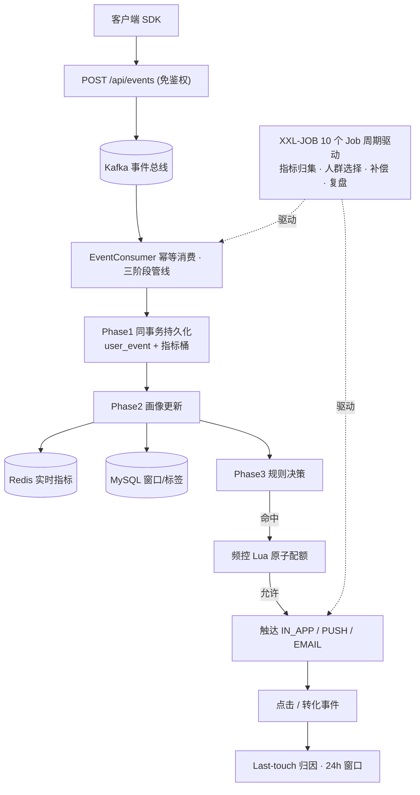
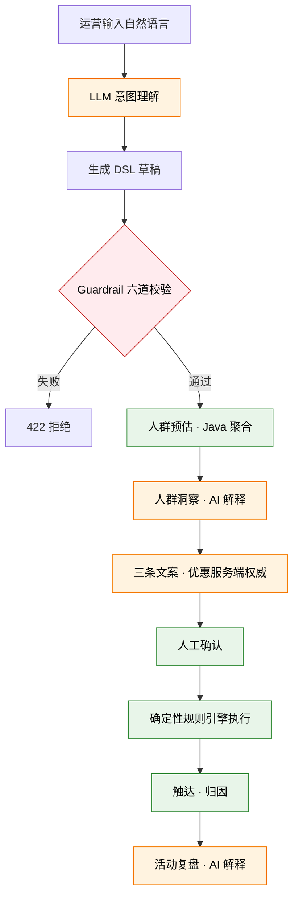

# PulseFlow

> 一个具有完整事件链路、确定性规则执行、AI 安全边界、并发可靠性和 CI 验证的**智能用户运营后端项目**。
>
> 事件驱动的 CDP + Campaign 平台：接入用户行为 → 实时画像 → 规则决策 → 频控触达 → 归因复盘，并叠加 AI Campaign Copilot 把自然语言运营目标转换成受约束的规则 DSL。

---

## 30 秒看懂这个项目

招聘者常问的几个问题，先给结论：

- **解决什么问题**：内容社区 + 电商增长场景下，把"用户做了什么"实时变成"该给谁推什么"。一条链路打通**行为接入 → 画像计算 → Campaign 决策 → 频控触达 → 转化归因**，并在创建环节叠加 AI 辅助。
- **为什么用 Kafka**：行为事件天然是高吞吐、可重放的数据流。Kafka 做事件缓冲 + at-least-once 投递，消费端用 `eventId` 幂等去重，兼顾吞吐与正确性。
- **为什么用 Redis**：三类用途各取所需——**实时画像**（todayViews 等当天计数）、**频控原子配额**（Lua 脚本一次性完成"判额+扣减+标记"）、**延迟任务 ZSET**（购物车挽回等延迟触达）。
- **为什么用 XXL-JOB**：把"不该在请求链路里做的重活"剥离到调度侧——窗口/日指标归集、Campaign 人群批量选择、AI 复盘扫描、补偿重试、延迟任务恢复，全部由 10 个 Job 周期驱动。
- **AI 在哪里发挥作用**：只在**理解与解释**层——自然语言转 DSL、人群洞察、文案生成、活动复盘。聚合指标由 Java 计算，AI 只解释，不编造数字。
- **AI 为什么不能直接执行**：模型会幻觉。所以 AI 产出的是**受约束的规则 DSL**，经过字段白名单、类型/范围校验、时间合法性、证据字段和数字一致性校验后，仍由**确定性 Java 规则引擎**执行触达。AI 永远不直接发券、不发消息、不写业务库。
- **可靠性设计**：事件幂等消费、数据库 CAS 状态机防并发重复调用模型、可重试/数据未就绪/永久失败三态拆分、Redis/决策失败补偿恢复、资源归属校验防越权。
- **测试与 CI**：109 个测试（98 单元 + 11 集成），GitHub Actions + Testcontainers 真实跑通 Flyway V1~V5 迁移与事件幂等消费，零跳过零失败。

---

## 架构总览

下图是 PulseFlow 的整体架构。一条端到端业务链路：**行为事件 → Kafka → 画像 → Campaign 决策 → 频控触达 → 归因**。



### 端到端业务链路（一个购物车挽回的例子）

1. 用户 `CONTENT_VIEW` → `POST /api/events` → Kafka
2. `EventConsumer` 消费：Phase1 同事务写 `user_event` + `user_metric_hourly`（幂等）；Phase2 更新 Redis 实时浏览数 + MySQL 窗口活跃天数；Phase3 进 `DecisionEngine`
3. `DecisionEngine` 加载 ACTIVE 状态、`FIND_IN_SET(eventType)` 匹配的 Campaign，逐条评估 `CampaignRule`（PROFILE/EVENT/FREQUENCY）
4. 命中后 `FrequencyControlService` 用 Lua 脚本原子检查"用户日限 + 活动周限 + 重试幂等"，通过则写 `DeliveryTask`（`dedup_key` 唯一索引防重复触达）
5. `DeliveryService` 投递到 IN_APP/PUSH/EMAIL，用户点击后产生点击事件
6. 后续转化事件进 `AttributionService`，24h 窗口内 Last-touch 归因匹配到 Campaign，写 `attribution_record`

---

## AI Campaign Copilot：安全执行边界

下图说明 AI 在哪里介入、在哪里被截断。**LLM 是自然语言交互层，不是业务执行引擎。**



> **图例**：🟧 橙色 = AI 只做交互与解释 ｜ 🟥 红色 = Guardrail 截断点 ｜ 🟩 绿色 = Java 确定性执行。AI 只出现在橙色节点，业务执行全在绿色节点——LLM 是交互层，不是执行引擎。

### AI 为什么不能直接执行

| 风险 | 对应防护 |
|---|---|
| 模型编造不存在的字段 | `AiFieldRegistry` 12 个白名单字段，不在表内直接拒绝 |
| 类型/范围错乱（活跃天数=999） | 每字段声明 `ValueType` + `min/max`，`activeDays7d ≤ 7` 等业务边界强校验 |
| 时间填过去 / 时区错 | `sendAt` 必须未来 + 必须带 offset + 与 `timezone` 交叉校验 |
| 文案里优惠金额被改 | 优惠事实只从服务端草稿读取，请求体 `operatorId`/优惠字段一律忽略 |
| 复盘编造数字 | `evidenceKeys` + 数字一致性校验：模型说的数字必须等于 Java 算出来的数字，对不上返回 422 |
| 并发重复调用模型烧钱 | `campaign_ai_review` 表 CAS 状态机 + `regenerate` 60 秒冷却 |
| 越权操作他人草稿/活动 | `requireDraftOwner` + `requireCampaignOwner`，`created_by=null` 历史数据默认拒绝 |

---

## 可靠性设计

这是项目区别于"调一下大模型"的练手 Demo 的核心部分。

### 1. 事件幂等消费（at-least-once + 幂等）

Kafka 是 at-least-once，重复消费不可避免。`EventPersistenceService` 用 `user_event.event_id` 唯一索引去重：重复 `eventId` 触发 `DuplicateKeyException` → 从 DB 加载标准事件继续后续阶段，**不信任 Kafka 重放 payload**。指标桶用 `INSERT … ON DUPLICATE KEY UPDATE` 原子累加。

### 2. 决策补偿恢复

`DecisionEngine` 的异常传播契约：业务跳过（规则不匹配、dedup 命中）内部消化；**基础设施异常（DB/Redis/Kafka 失败）必须向外抛**，让 `EventConsumer` 写补偿任务，由 `CompensationJob` 重试。否则会静默丢决策。

### 3. AI 复盘并发抢占（数据库 CAS 状态机）

不用 Redis 分布式锁，而是在 `campaign_ai_review` 表上做条件 UPDATE 抢占：

```
(absent) --INSERT PENDING--> PENDING --CAS--> PROCESSING --AI--> SUCCESS
                                              |
                                         AI 失败(可重试)
                                              v
                                       RETRYABLE_FAILED --指数退避--> PROCESSING
                                              |
                                         重试上限
                                              v
                                       PERMANENT_FAILED (终态)

audience=0 / 宽限期后 sentCount=0 ──> SKIPPED_INSUFFICIENT_DATA (终态)
宽限期内 sentCount=0          ──> DATA_NOT_READY (可重试，等消费链路归集)
```

只有 `affected=1` 的执行器才调用 LLM，其余静默跳过。状态可观测（查表即知谁在处理），失败重试简单（下轮 Job 自动拾取），无额外中间件依赖。

### 4. 三态拆分：不会把"数据延迟"误判成"数据不足"

`assessDataReadiness` 区分三种"数据不够"：
- `targetAudienceCount ≤ 0` → `SKIPPED_INSUFFICIENT_DATA`（终态：无目标人群永远不会变）
- `sentCount = 0` 且在 `data-ready-delay-minutes` 宽限期内 → `DATA_NOT_READY`（可重试：Campaign 刚结束、消费链路可能仍在归集）
- `sentCount = 0` 且宽限期已过 → `SKIPPED_INSUFFICIENT_DATA`（终态：数据确实缺失）

避免把"消费链路延迟"永久标记为"数据不足"而放弃复盘。

### 5. 频控原子配额

`FrequencyControlService` 用一段 Lua 脚本在 Redis 里原子完成"判额 + 扣减 + 重试标记"：用户日限 + 活动周限 + `freq:reserved:{taskId}`（重试不重复扣额）。失败 fail-safe 拒绝。

### 6. 资源归属防越权

登录校验 ≠ 归属校验。`requireDraftOwner` 校验草稿 `operatorId`，`requireCampaignOwner` 校验 `campaign.createdBy`。**历史 `created_by=null` 数据默认拒绝普通用户访问**，只允许创建者本人读取自己的复盘，防止猜 ID 越权。

---

## 模块结构

```
pulseflow/
├── pulseflow-common      # 通用 DTO / 枚举 / 工具 / 实体 / Mapper
├── pulseflow-event       # 事件接入 (POST /api/events) + Kafka 消费 + 幂等持久化
├── pulseflow-profile     # 用户画像: 实时(Redis) / 窗口(MySQL) / 标签(MySQL)
├── pulseflow-campaign    # Campaign 决策引擎 + 频控 + 触达 + Last-touch 归因
├── pulseflow-job         # XXL-JOB 调度 (10 个 Job: 指标归集/人群选择/补偿/重试/复盘扫描)
├── pulseflow-simulator   # 演示数据模拟器 (注入事件 / 用户旅程)
├── pulseflow-ai          # AI Campaign Copilot (NL→DSL / 洞察 / 文案 / 复盘)
└── pulseflow-boot        # 启动模块: 配置 / Flyway 迁移 / Sa-Token / 全局异常
```

### 技术栈

| 层 | 选型 | 用途 |
|---|---|---|
| 框架 | Spring Boot 3.2.5 + Java 17 | 主框架 |
| ORM | MyBatis-Plus | 实体/Mapper，Lambda 查询 |
| 消息 | Kafka | 行为事件总线，at-least-once |
| 缓存 | Redis (Redisson) | 实时画像 / 频控 Lua / 延迟任务 ZSET |
| 调度 | XXL-JOB | 10 个周期 Job |
| 鉴权 | Sa-Token | 登录拦截 + `StpUtil.getLoginId()` 服务端权威 operatorId |
| 迁移 | Flyway | V1~V5 数据库版本管理 |
| AI | OpenAI Compatible + Azure AI Language PII | 可配 `mock-enabled=true` 本地零成本启动；PII 为可选外部云服务 |
| 测试 | JUnit 5 + Testcontainers | 109 测试，CI 真实跑 Docker IT |

---

## 测试与 CI

### 测试规模

| 模块 | 单元测试 | 覆盖点 |
|---|---|---|
| pulseflow-ai | 82 | NL→DSL 校验、Guardrail、Campaign 创建链路、复盘状态机（含 DATA_NOT_READY 宽限重试 + 资源归属 4 场景） |
| pulseflow-campaign | 9 | DecisionEngine 6（PROFILE/EVENT/FREQUENCY/幂等/延迟）+ Attribution 3（Last-touch/过期/幂等） |
| pulseflow-event | 1 | 事件持久化幂等 |
| pulseflow-common | 6 | 通用工具 |
| pulseflow-boot (IT) | 11 | AiModeBootstrapIT 6（双模式启动）+ FlywayMigrationIT 2（V1~V5）+ EventIdempotentConsumptionIT 3（幂等消费） |
| **合计** | **109** | **0 失败** |

### CI

[`.github/workflows/ci.yml`](.github/workflows/ci.yml) + 父 `pom.xml` 的 `ci-enforce-docker-tests` profile：

- `GITHUB_ACTIONS=true` 时 enforcer 强制 `PULSEFLOW_TEST_DOCKER=true`，否则构建失败——**Docker 集成测试不允许被静默跳过**
- `mvn clean verify` 单条命令执行 `*Test`（surefire）+ `*IT`（failsafe）
- GitHub Runner 上真实拉 `mysql:8.0` 镜像跑 Flyway 迁移与事件幂等消费，**11 个 IT 零跳过零失败**

> 用 `GITHUB_ACTIONS` 而非 `CI` 变量做 enforcer 触发条件，因为本地 IDE（Trae CN）会设 `CI=true`，会误触发。

---

## 本地运行

### 前置依赖

- JDK 17
- Maven 3.8+
- MySQL 8.0（库 `pulseflow`，Flyway 自动建表）
- Redis 6+
- Kafka 3.x
- XXL-JOB-Admin 2.4+（独立部署，默认 `http://localhost:8081/xxl-job-admin`）

> 不想跑全套中间件也能启动：AI 默认 `mock-enabled=true` 零成本；MySQL/Redis/Kafka 缺失时相关链路降级。

### 配置

关键配置在 [`pulseflow-boot/src/main/resources/application.yml`](pulseflow/pulseflow-boot/src/main/resources/application.yml)，敏感项走环境变量：

```bash
export MYSQL_PASSWORD=root
export PULSEFLOW_AI_BASE_URL=https://api.example.com/v1   # 可选，mock 模式不需要
export PULSEFLOW_AI_API_KEY=sk-xxx                         # 可选，mock 模式不需要
export PULSEFLOW_AI_MODEL=gpt-4o-mini                      # 可选
export PULSEFLOW_AI_PII_ENABLED=true                       # 生产启用 Azure PII 时设置
export AZURE_LANGUAGE_ENDPOINT=https://<resource>.cognitiveservices.azure.com/
export AZURE_LANGUAGE_KEY=<azure-language-key>             # 仅环境变量，不提交 Git
```

AI 开关（默认关闭，可彻底关闭 AI 模块双模式启动）：

```yaml
pulseflow:
  ai:
    enabled: false          # 总开关
    mock-enabled: true      # 本地/CI 用 FakeAiModelClient，零成本
    pii:
      enabled: false        # Azure AI Language PII，默认关闭
      language: zh-hans     # 简体中文（Azure 也接受 zh）
      timeout-seconds: 5
```

AI 输入采用双层 Guardrail：Java 本地业务字段规则始终保留（例如 `userId`、`rawEvents`、`orderDetails`、`deviceId`），并且会阻止自然语言中显式出现这些内部业务字段标识；自然语言 PII 在 `pii.enabled=true` 时交给 Azure AI Language Text PII 检测。手机号、中文姓名、地址、Email、银行卡等检测到后直接阻止 AI 请求，不把脱敏文本继续发送给 LLM；Azure 超时、5xx 或 SDK 异常也采用 Fail-Closed。Azure Key 只从 `AZURE_LANGUAGE_KEY` 环境变量读取，不进入日志或 `ai_generation_record`；CI 和 Mock 模式使用 `FakePiiDetectionClient`，不访问真实 Azure。真实 AI（`mock-enabled=false`）启动时强制要求 PII Guardrail 开启并校验 Azure 配置；PII/AI 关闭时不影响核心确定性业务链启动。

### 启动

```bash
cd pulseflow
mvn clean install -DskipTests
mvn spring-boot:run -pl pulseflow-boot
# 应用监听 8080；XXL-JOB executor 监听 9999
```

### 数据库迁移

Flyway 自动执行 [`V1~V5`](pulseflow/pulseflow-boot/src/main/resources/db/migration)：

| 版本 | 内容 |
|---|---|
| V1 | 15 张核心表：user_event / user_metric_hourly / user_behavior_summary / user_tag / campaign / campaign_rule / delivery_task / delivery_record / attribution_record 等 |
| V2 | 渠道幂等表：in_app_message / push_record |
| V3 | AI Campaign Copilot 表：campaign_ai_draft / campaign_ai_review / campaign_performance_summary / campaign_content_variant |
| V4 | AI 复盘状态机列（locked_by / locked_at / version）+ 扫描索引 idx_ai_review_status |
| V5 | 状态拆分（failure_code / retryable / retry_count / next_retry_at）+ `campaign.created_by` 资源归属 + 重试调度索引 idx_ai_review_status_retry |

---

## AI Campaign Copilot API

所有 `/api/**` 端点需 Sa-Token 登录（例外：`/api/events` 公开事件接入，`/api/auth/dev-login` 仅演示模式 opt-in 启用），`operatorId` 从 `StpUtil.getLoginId()` 服务端获取（忽略请求体，防伪造）。

| 方法 | 路径 | 用途 |
|---|---|---|
| POST | `/api/ai/campaigns/parse` | 自然语言 → DSL 草稿 + 人群预估 |
| PUT | `/api/ai/campaigns/drafts/{draftId}` | 编辑草稿 DSL（重新校验） |
| POST | `/api/ai/campaigns/drafts/{draftId}/refresh-preview` | 刷新人群预估 |
| POST | `/api/ai/campaigns/drafts/{draftId}/insight` | 人群洞察（AI 解释 Java 算好的指标） |
| POST | `/api/ai/campaigns/drafts/{draftId}/contents` | 生成三条差异化文案 |
| POST | `/api/campaigns/from-ai-draft/{draftId}` | **确认创建**（AI 不绕过，走原 Campaign 引擎） |
| GET | `/api/ai/campaigns/{campaignId}/review` | 获取活动复盘 |
| POST | `/api/ai/campaigns/{campaignId}/review/regenerate` | 重新生成复盘（60s 冷却 + 归属校验） |

### DSL 字段白名单（AiFieldRegistry）

AI 只能引用这 12 个受信字段：

| fieldCode | 类型 | 含义 |
|---|---|---|
| `todayViews` | INTEGER | 今日浏览数 |
| `cartItemCount` | INTEGER | 购物车商品数 |
| `searchCount1h` | INTEGER | 近 1h 搜索次数 |
| `activeDays7d` | INTEGER | 近 7 天活跃天数（≤7） |
| `viewCount7d` | INTEGER | 近 7 天浏览次数 |
| `spend30d` | DECIMAL | 近 30 天消费金额 |
| `orderCount30d` | INTEGER | 近 30 天订单数 |
| `daysSinceLastPurchase` | INTEGER | 距上次购买天数 |
| `registrationDays` | INTEGER | 注册天数 |
| `HIGH_VALUE` | BOOLEAN | 高价值用户标签 |
| `PRICE_SENSITIVE` | BOOLEAN | 价格敏感用户标签 |
| `CHURN_RISK` | BOOLEAN | 流失风险标签 |

### 异常映射

| 异常 | HTTP | 含义 |
|---|---|---|
| `AiDisabledException` | 503 | AI 功能关闭 |
| `AiProviderException` | 503 | 模型不可用/超时/限流 |
| `AiOutputInvalidException` | 422 | AI 输出未通过业务校验 |
| `AiResourceNotFoundException` | 404 | 草稿/Campaign 不存在 |
| `AiConflictException` | 409 | 草稿状态冲突 |
| `AiForbiddenException` | 403 | 越权操作（7.2 新增） |
| regenerate 频繁 | 429 | 60s 冷却内重复调用 |

---

## 文档

- [设计文档](pulseflow-design.md)
- [AI 指标口径字典](docs/ai-metrics-glossary.md)
- [工程验证报告](docs/engineering-verification.md)

---

## 项目定性

这不是"调一下大模型"的练手 Demo，而是一个：

- ✅ **完整事件链路**：接入 → 画像 → 决策 → 触达 → 归因，全链路幂等
- ✅ **确定性规则执行**：PROFILE/EVENT/FREQUENCY 规则引擎 + Lua 频控
- ✅ **AI 安全边界**：LLM 只理解与解释，Guardrail 截断，执行归 Java
- ✅ **并发可靠性**：数据库 CAS 状态机 + 三态拆分 + 补偿恢复
- ✅ **CI 验证**：GitHub Actions + Testcontainers 真实跑通 Docker IT
