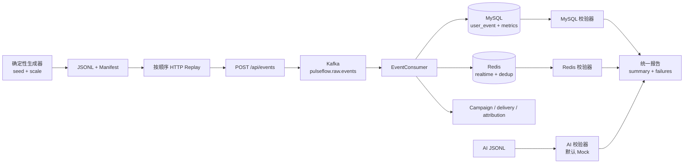

# PulseFlow 数据验收测试 — 第一阶段

## 中文说明

这是 PulseFlow 第一阶段的数据验收测试目录，目标是把真实业务事件通过
`HTTP → Kafka → MySQL/Redis → Campaign` 全链路跑一遍，并使用固定 Manifest
自动比对预期结果。这里的工具只用于测试，不修改业务代码，也不会连接生产环境。

常用入口：

- `.\testing\scripts\run-baseline.ps1`：运行已有 Maven 基线测试；
- `.\testing\scripts\generate-dataset.ps1 small`：生成固定 seed 的 SMALL 数据集；
- `.\testing\scripts\run-full-validation.ps1 -PrepareDependencies`：准备 Docker 测试依赖并执行完整验收；
- `.\testing\scripts\run-edge-validation.ps1`：运行重复、乱序、迟到和非法输入场景；
- `.\testing\scripts\run-campaign-validation.ps1`：运行频控与归因 fixture；
- `.\testing\scripts\evaluate-ai.ps1`：默认只做 Mock/离线 AI 数据集检查。

所有生成数据和运行报告都放在 `datasets/generated`、`reports/<run-id>`，并已被
Git 忽略。测试目标必须是 loopback 地址、测试数据库和
`PULSEFLOW_TEST_ENV=test`。任何断言失败、依赖缺失或环境不安全都会返回非零；
`NOT_RUN` 不等于 PASS。源码契约、数据字段和当前已知缺口见下文。

这里是 PulseFlow 第一阶段的可重复数据测试层。它与业务模块保持独立：生成数据、
Replay 工具、校验器、k6 场景和报告都放在这里，生产代码保持不变。

## 基于源码的真实契约审查

测试工具以当前源码为准，而不是以设计文档为准：

| 关注点 | 当前源码契约 |
|---|---|
| 事件接入 | `POST /api/events`，免鉴权，JSON 对应 `EventRequest` |
| 事件字段 | `eventId`、`userId`、`eventType`、可选 `targetId`/`properties`、`eventTime` |
| EventType | `LOGIN`、`CONTENT_VIEW`、`SEARCH`、`LIKE`、`FAVORITE`、`ADD_CART`、`REMOVE_CART`、`ORDER_CREATE`、`ORDER_PAID`、`SHARE`、`CLICK` |
| Kafka | `pulseflow.raw.events`，Key 为 `userId`，4 个分区 |
| 持久化 | `user_event.event_id` 唯一；`user_metric_hourly` 按用户/小时/类型 upsert |
| 时钟偏差 | `abs(eventTime - receiveTime).toMinutes() > 5` 才标记 `clockSkew`；接口不会拒绝迟到/未来事件 |
| 归因 | `ORDER_PAID` 创建 `attribution_task`；匹配从 `click_event` 读取，而原始 `CLICK` 消费路径不会写入该表 |
| Redis | `event:processed:*`、`user:rt:*`、`user:daily:*`、`user:cart:*`、`freq:*` 及延迟 ZSET |
| Campaign/AI API | AI 接口需要 Sa-Token；开发登录必须显式开启；当前没有通用点击记录 HTTP 接口 |

`testing/scripts/verify_contract.py` 会在验收前重新检查关键源码契约，避免源码变化后
测试数据仍默默使用旧接口。

## 测试架构



## 标准验收流程

1. 检查源码契约和测试目标安全性。
2. 编译并运行已有 Maven 测试。
3. 生成固定 seed 的 SMALL 数据集（`1000` 用户、`10000` 事件）。
4. 按文件顺序 Replay，并记录每个 HTTP 响应。
5. 等待 MySQL 中达到预期的唯一事件数。
6. 比对 MySQL 指标总量，以及 Redis processed flag/TTL。
7. 在 `testing/reports/<run-id>/` 生成 `summary.json`、`summary.md`、
   `mysql-validation.json`、`redis-validation.json`、`failures.json`，
   以及适用时的 `k6-summary.json`。

每个断言失败都会尽量保留 dataset id、输入行、预期、实际、涉及模块、异常/日志和
可重放命令。依赖缺失会记录为 `NOT_RUN`，并使对应命令返回非零，不会被包装成 PASS。

## 目录结构

```text
testing/
├── README.md
├── adr/
├── datasets/
│   ├── ai/
│   ├── fixtures/
│   │   └── regressions/
│   └── generated/          # 仅运行时生成，已被 Git 忽略
├── docker-compose.test.yml # 隔离的 MySQL/Redis/Kafka 测试依赖
├── generator/
│   └── generate_dataset.py
├── k6/
│   ├── smoke.js
│   ├── load.js
│   ├── stress.js
│   └── scenarios/
├── scripts/
│   ├── common.ps1
│   ├── evaluate-ai.ps1
│   ├── generate-dataset.ps1
│   ├── prepare-campaign-fixture.ps1
│   ├── replay-dataset.ps1
│   ├── run-baseline.ps1
│   ├── run-campaign-validation.ps1
│   ├── run-edge-validation.ps1
│   ├── run-full-validation.ps1
│   ├── run-smoke.ps1
│   ├── validate.ps1
│   └── verify-contract.py
└── validators/
    ├── mysql/
    ├── redis/
    └── validate_run.py
```

## 生成数据集

生成器只依赖 Python 3.10+ 标准库。它使用固定基准时间和固定随机种子，因此相同
seed、scale 和代码版本会生成相同 JSONL 字节及 SHA-256 checksum。

```powershell
.\testing\scripts\generate-dataset.ps1 small
.\testing\scripts\generate-dataset.ps1 medium -Scenario normal
.\testing\scripts\generate-dataset.ps1 large -Scenario normal
```

默认 `all` 会生成：

- `normal-events-{scale}-v1`：覆盖 1 小时、1 天、7 天、30 天的正常有效事件；
- `duplicate-events-v1`：完全重复、Payload 冲突和十次重放；
- `out-of-order-events-v1`：事件时间顺序与到达顺序不同，包含先到转化、后到点击；
- `late-events-v1`：边界内、刚好边界、边界外、严重过期及未来事件；
- `invalid-payload-v1`：格式、缺字段、类型、范围和未知类型用例，并带源码预期 HTTP 状态码；
- `hot-user-events-{scale}-v1`：SMALL 为单用户 1,000 条，MEDIUM/LARGE 为 10,000 条；
- `campaign-frequency-attribution-v1`：配合 SQL fixture 使用的 Campaign、频控和迟到点击场景。

LARGE 只在运行时生成，不应提交到 Git。

## Replay 与校验

应用应连接隔离的测试依赖。Compose 使用非默认端口：MySQL `13306`、Redis `16379`、
Kafka `19092`。本地启动应用时，请覆盖 `spring.datasource`、`spring.redis` 和
`spring.kafka` 配置。

```powershell
docker compose -f testing/docker-compose.test.yml -p pulseflow-test up -d

# 在另一个 PowerShell 中，以 APP_ENV=test 和测试端口启动应用。
.\testing\scripts\replay-dataset.ps1 `
  -Dataset .\testing\datasets\generated\normal-events-small-v1.jsonl
.\testing\scripts\validate.ps1 `
  -Manifest .\testing\datasets\generated\normal-events-small-v1.manifest.json
```

Campaign/频控/归因 Fixture 需要先准备一次性测试数据库，Replay 专用数据集，并等待
5 分钟 Attribution grace window；也可以手动触发调度器：

```powershell
.\testing\scripts\prepare-campaign-fixture.ps1
.\testing\scripts\replay-dataset.ps1 `
  -Dataset .\testing\datasets\generated\campaign-frequency-attribution-v1.jsonl
.\testing\scripts\validate.ps1 `
  -Manifest .\testing\datasets\generated\campaign-frequency-attribution-v1.manifest.json `
  -WaitSeconds 360
```

同一套 Campaign 流程也可以直接执行：

```powershell
.\testing\scripts\run-campaign-validation.ps1
```

边界/乱序场景可以增加 `-RebaseEventTime`：它会保持 Fixture 内的相对时间差，同时把
事件时间移动到当前本地时间附近。这样既不改变固定 checksum，又能在数据集生成日期
之后测试 5 分钟边界和乱序关系。

SQL Fixture 默认对应 seed `20260827`。如果换 seed，必须先更新 SQL 注释/Fixture 中的
确定性 conversion id，否则 Attribution 断言没有意义。

更安全的完整入口会按顺序执行检查、Build、生成、Replay、等待和校验：

```powershell
.\testing\scripts\run-full-validation.ps1 -PrepareDependencies
```

它要求应用已经运行在 `http://localhost:8080`，不会随意启动未知进程，也不会修改生产
配置。Validator 只接受本机回环地址、测试数据库名和测试环境变量。只有在明确没有
k6 时才使用 `-SkipK6`，报告会记录 `NOT_RUN`。

## k6 场景

k6 脚本使用真实 `EventRequest` 结构和源码中存在的 EventType，检查 HTTP 状态码及
`ApiResponse.code`，并输出请求数、失败率以及 p50/p95/p99 延迟指标。

```powershell
k6 run -e BASE_URL=http://localhost:8080 .\testing\k6\smoke.js
k6 run -e BASE_URL=http://localhost:8080 .\testing\k6\load.js
```

`stress.js` 仅允许手动执行，必须显式传入 `-e ALLOW_STRESS=true`；它不属于完整验收
的默认步骤。

## AI 评估数据集

`datasets/ai/campaign-intent-eval.jsonl` 覆盖正常需求、模糊表达、未知/非法字段、PII、
Prompt Injection、超长/空输入、极端数字、矛盾条件、中文口语和错别字。断言关注
Parser 成功、DSL 状态、敏感数据结果和人群预估结构，不比较固定 LLM 文本。

旁边的 Manifest 记录 case 数、类别、固定 seed 和 checksum。Evaluator 默认使用本地
Mock；Real Provider 评估必须手动执行，并需要已有认证会话，不会由 CI 或全链路 Replay
自动调用。

## 已有测试与刻意保留的缺口

仓库已有 Decision、Attribution、事件持久化、AI Guardrail/Flow 的 JUnit 测试，以及
MySQL Testcontainers IT。本层不重复写同类测试，主要增加数据规模 Replay 和外部存储
可观测性。当前源码没有 Redis/Kafka Testcontainers，也没有现成 Docker Compose，因而
新增 Compose 用于本地全链路依赖；已有 Maven IT 继续负责原有范围。

下面是测试阶段发现、留给下一阶段修复的问题，本阶段不修复：

- 原始 `CLICK` 会写入 `user_event`，但不会物化为 `click_event`，所以仅靠 HTTP
  Attribution fixture 无法完成归因；
- 接入 DTO 层不会拒绝 invalid/unknown EventType、负数金额、UUID 格式错误或超长
  event id，下游行为由 invalid dataset 负责测量；
- 源码使用 `Duration.toMinutes() > 5`，导致迟到 5 分钟加 1 毫秒的事件仍处于非 skew
  一侧，直到超出完整 1 秒才会被标记；
- `docs/demo/demo-scenario.md` 使用了源码枚举不存在的 `CAMPAIGN_CLICK`，源码有效
  EventType 是 `CLICK`；
- 仓库文档中的 109-test/11-IT 统计与当前 clean build 不一致；当前结果为 104 个
  Surefire 测试和 15 个 Failsafe case，其中 5 个受 Docker 环境 gate 跳过；
- 已有 Maven integration test 受 `PULSEFLOW_TEST_DOCKER=true` 环境变量控制；没有 Docker
  时必须报告为 skipped/`NOT_RUN`，不能描述为完整 integration pass。
